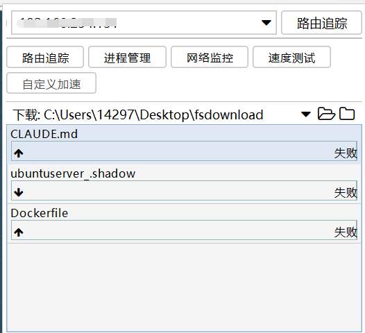
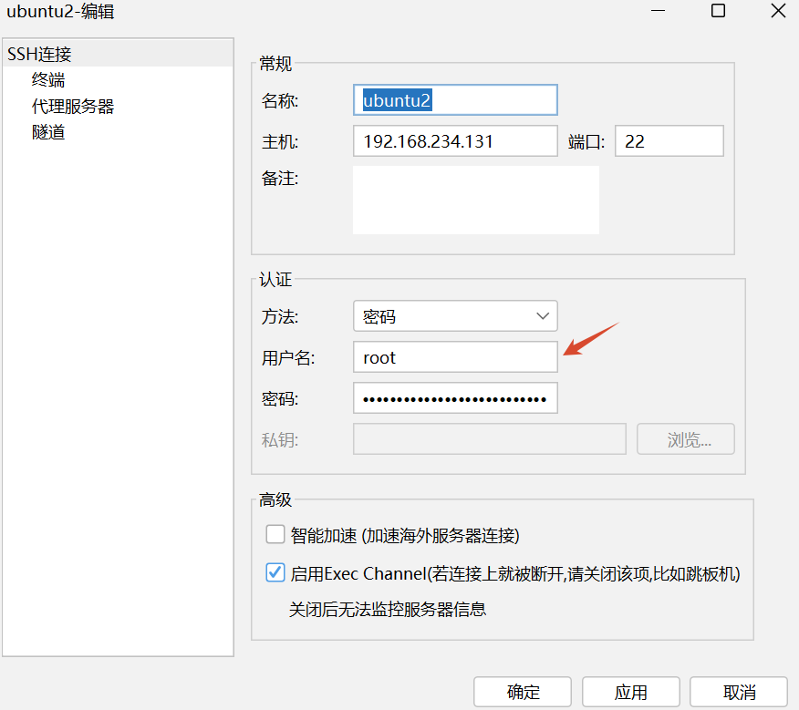
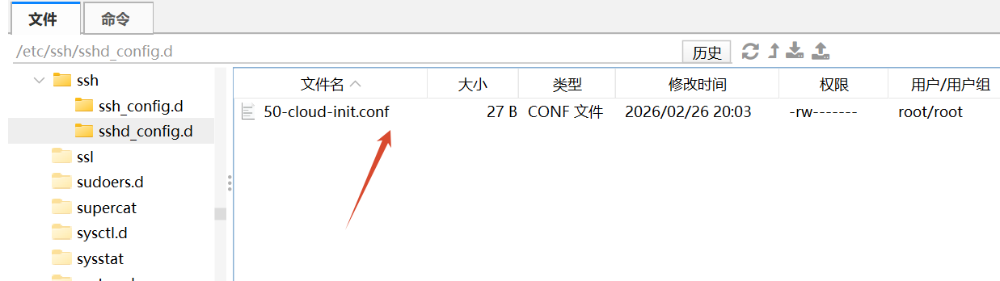
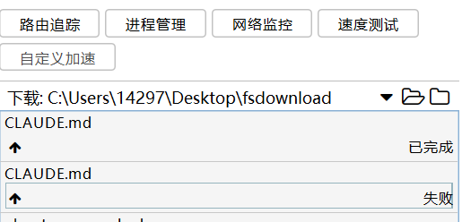

+++
date = '2026-05-09T23:22:29+08:00'
draft = false
title = '解决FinalShell文件上传失败的方法'
tags = ['FinalShell']

+++

## 问题描述

在使用FinalShell上传本地文件时出现上传失败的情况，如图：

## 原因分析

核心原因是连接账号的权限不足，非root用户无法上传文件。

于是更改为root用户：

但此处设置的前提是你已经设置了root密码。

查看root密码，此处以ubuntu为例：

`vim /etc/shadow`或`passwd -S root`

如果文件中显示`root : * : 20494 : 0 : 99999 : 7 : : :`或命令输出L，则表示密码已被锁定/禁用，无法使用root密码登录。

重新设置root密码`sudo paaswd root`，输入两次密码即可。

密码设置完成后，点击应用并确定，再次连接，发现依然无法连上，即使输入密码正确。

配置`/etc/ssh/ssh_config`：

- `PermitRootLogin yes`

- `PasswordAuthentication yes`
- 重启ssh`systemctl restart ssh`

在我查看的大部分教程中到这里就结束了，一般就可以连上了，但是ubuntu环境下在`/etc/ssh/sshd_config.d`中还存在更高优先级的配置文件，如果其中缺失了上述两条配置，依然是无法生效的。

如图：

打开改配置文件，插入`PermitRootLogin yes`和`PasswordAuthentication yes`。

到这里，root登录的配置才算完整。

使用root登录并上传：

成功🙌
